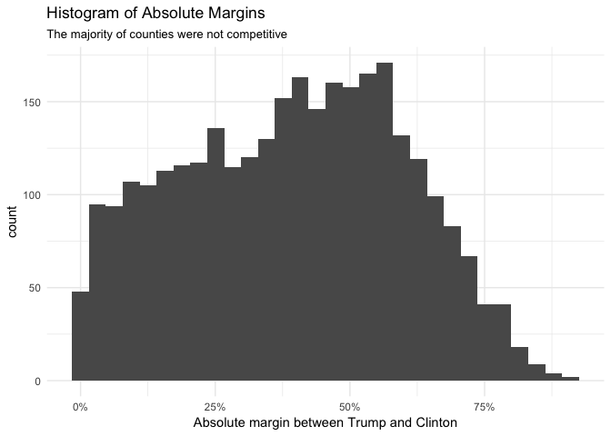
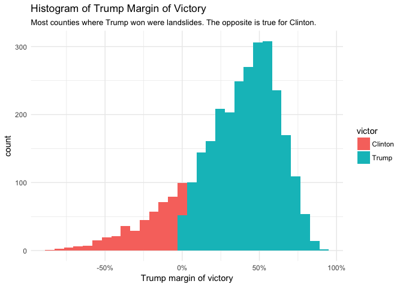
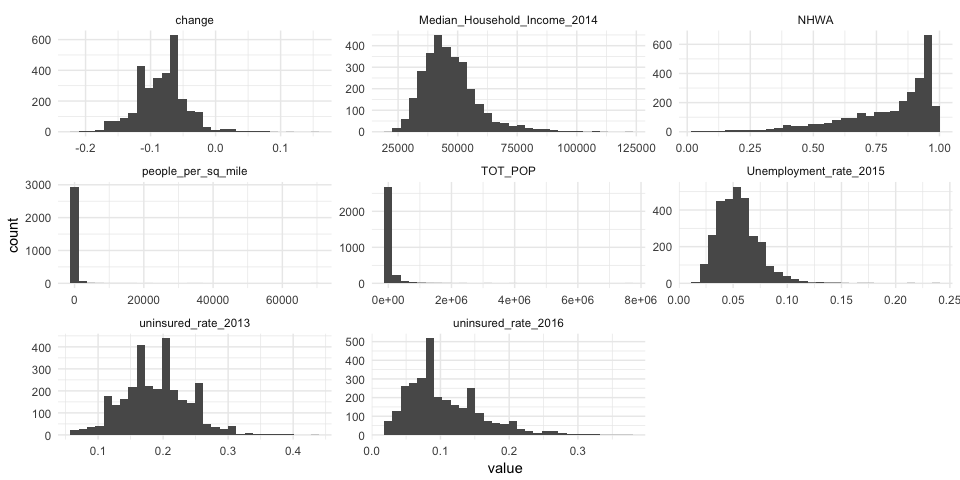
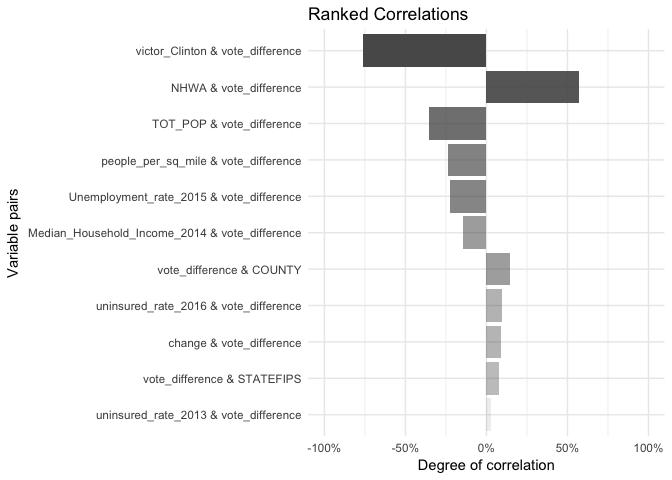
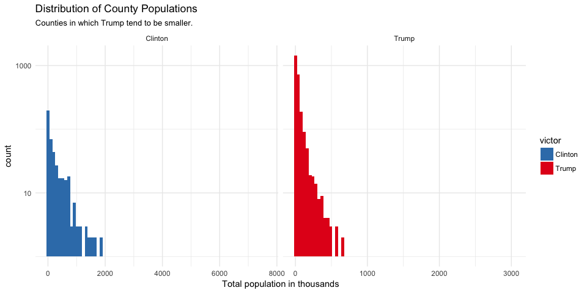
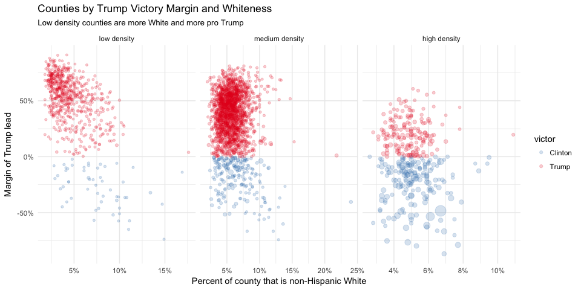
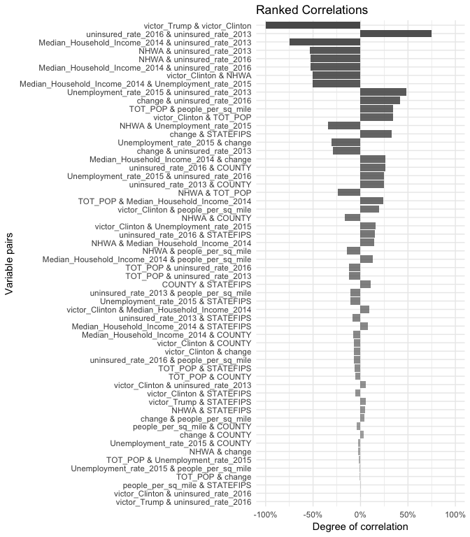
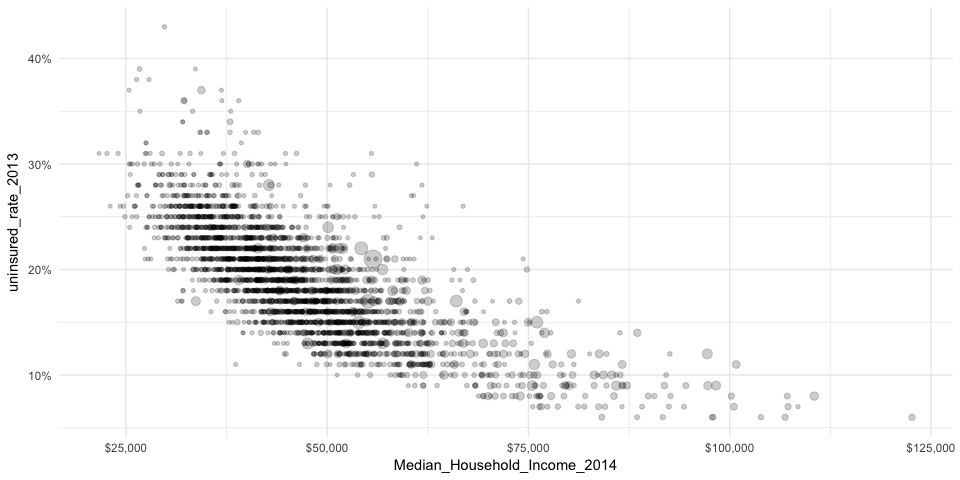

The Data
--------

#### The election data

The data I am using is from US Election Atlas, which sells proprietary data. As a result, I will not include their entire dataset here. Instead, I will only include a variable that represents the vote difference between the candidates on a county level.

``` r
library(tidyverse)
```

``` r
election <- read_csv("data/clean/Pres_Election_Data_2016i.csv", col_types = cols())
```

"Margin" represents the margin of victory with which Donald Trump won a particular county. A positive value corresponds to a Trump victory, a negative value corresponds to a Clinton victory.

    ## # A tibble: 3,026 × 4
    ##    STATEFIPS COUNTY vote_difference  victor
    ##        <int>  <dbl>           <dbl>   <chr>
    ## 1          1      3          0.5721   Trump
    ## 2          1      5          0.0560   Trump
    ## 3          1      7          0.5513   Trump
    ## 4          1      9          0.8092   Trump
    ## 5          1     11         -0.5077 Clinton
    ## 6          1     13          0.1349   Trump
    ## 7          1     15          0.4105   Trump
    ## 8          1     17          0.1474   Trump
    ## 9          1     19          0.6899   Trump
    ## 10         1     21          0.6626   Trump
    ## # ... with 3,016 more rows

``` r
ggplot(election, aes(x = abs(vote_difference))) +
  geom_histogram() + 
  scale_x_continuous(labels = scales::percent) +
  labs(title = "Histogram of Absolute Margins",
       subtitle = "The majority of counties were not competitive",
       x = "Absolute margin between Trump and Clinton") +
  theme_minimal()
```

    ## `stat_bin()` using `bins = 30`. Pick better value with `binwidth`.



``` r
ggplot(election, aes(x = vote_difference, fill = victor)) +
  geom_histogram() + 
  scale_x_continuous(labels = scales::percent) +
  labs(title = "Histogram of Trump Margin of Victory",
       subtitle = "Most counties where Trump won were landslides. The opposite is true for Clinton.",
       x = "Trump margin of victory") +
  theme_minimal()
```

    ## `stat_bin()` using `bins = 30`. Pick better value with `binwidth`.



#### Other county level data

There are county level datasets available for free from a variety of government sources. These were cleaned in R (HYPERLINK) then uploaded to SQL Server for further cleaning and data mining.

County Density:

``` r
density <- read_csv("data/raw/county_density.csv", skip = 1, 
         col_types = cols_only(`Target Geo Id` = col_character(),
                               `Density per square mile of land area - Population` = col_double())) %>% 
  filter(nchar(`Target Geo Id`) == 14) %>% 
  transmute(STATEFIPS = as.numeric(substr(`Target Geo Id`, start = 10, stop = 11)),
            COUNTY = as.numeric(substr(`Target Geo Id`, start = 12, stop = 14)),
            people_per_sq_mile = `Density per square mile of land area - Population`)
```

    ## # A tibble: 3,221 × 3
    ##    STATEFIPS COUNTY `People per square mile`
    ##        <dbl>  <dbl>                    <dbl>
    ## 1          1      1                     91.8
    ## 2          1      3                    114.6
    ## 3          1      5                     31.0
    ## 4          1      7                     36.8
    ## 5          1      9                     88.9
    ## 6          1     11                     17.5
    ## 7          1     13                     27.0
    ## 8          1     15                    195.7
    ## 9          1     17                     57.4
    ## 10         1     19                     46.9
    ## # ... with 3,211 more rows

Affordable Care Act change in uninsured rates [from Enroll America](https://www.enrollamerica.org/research-maps/maps/changes-in-uninsured-rates-by-county/):

``` r
insurance <- read_csv("data/raw/County_Data_2016_health_insurance.csv",
         col_types = list(county_fips = col_character())) %>% 
  setNames(gsub(pattern = " ", replacement = "_", names(.))) %>% 
  transmute(STATEFIPS = ifelse(nchar(county_fips) == 5,
                               as.numeric(substr(county_fips, start = 1, stop = 2)),
                               as.numeric(substr(county_fips, start = 1, stop = 1))),
                               COUNTY = as.numeric(substr(county_fips, start = nchar(county_fips) - 2, stop = nchar(county_fips))),
                               uninsured_rate_2013 = `2013_uninsured_rate` / 100,
                               uninsured_rate_2016 = `2016_uninsured_rate` / 100,
                               decrease_from_2013_to_2016 = decrease_from_2013_to_2016 / 100) %>% 
  rename(change = decrease_from_2013_to_2016) %>% 
  arrange(STATEFIPS, COUNTY)
```

    ## # A tibble: 3,238 × 5
    ##    STATEFIPS COUNTY `Rate Uninsured in 2013` `Rate Uninsured in 2016`
    ##        <dbl>  <dbl>                    <dbl>                    <dbl>
    ## 1          1      1                     0.17                     0.08
    ## 2          1      3                     0.17                     0.08
    ## 3          1      5                     0.24                     0.15
    ## 4          1      7                     0.20                     0.10
    ## 5          1      9                     0.19                     0.10
    ## 6          1     11                     0.28                     0.17
    ## 7          1     13                     0.24                     0.14
    ## 8          1     15                     0.21                     0.11
    ## 9          1     17                     0.25                     0.13
    ## 10         1     19                     0.22                     0.10
    ## # ... with 3,228 more rows, and 1 more variables: change <dbl>

Economic data from the [USDA](https://www.ers.usda.gov/topics/rural-economy-population/rural-classifications.aspx).

``` r
econ <- read_csv("data/raw/Unemployment.csv", skip = 6, 
         col_types = cols_only(FIPS_Code = col_character(),
                               Unemployment_rate_2015 = col_double(),
                               Median_Household_Income_2014 = col_number())) %>% 
  transmute(STATEFIPS = as.numeric(substr(FIPS_Code, 1, 2)),
            COUNTY = as.numeric(substr(FIPS_Code, 3, 5)),
            Unemployment_rate_2015 = Unemployment_rate_2015 / 100,
            Median_Household_Income_2014) %>% 
  filter(COUNTY != 0) 
```

    ## # A tibble: 3,223 × 4
    ##    STATEFIPS COUNTY `Unemployment rate in 2015`
    ##        <dbl>  <dbl>                       <dbl>
    ## 1          1      1                       0.052
    ## 2          1      3                       0.055
    ## 3          1      5                       0.089
    ## 4          1      7                       0.066
    ## 5          1      9                       0.054
    ## 6          1     11                       0.078
    ## 7          1     13                       0.075
    ## 8          1     15                       0.070
    ## 9          1     17                       0.060
    ## 10         1     19                       0.054
    ## # ... with 3,213 more rows, and 1 more variables: `Median household income
    ## #   in 2014` <dbl>

County characteristics dataset from the [Census](https://www.census.gov/popest/data/counties/asrh/2015/CC-EST2015-ALLDATA.html):

``` r
NHWA <- read_csv("data/raw/CC-EST2015-ALLDATA.csv",
         col_types = cols_only(STATE = col_integer(),
                               COUNTY = col_integer(),
                               TOT_POP = col_integer(),
                               AGEGRP = col_integer(),
                               YEAR = col_integer(),
                               NHWA_MALE = col_integer(),
                               NHWA_FEMALE = col_integer()),
         progress = F) %>% 
  filter(AGEGRP >= 5,
         YEAR == 8) %>% 
  rename(STATEFIPS = STATE) %>%
  group_by(STATEFIPS, COUNTY) %>% 
  summarise(TOT_POP = sum(TOT_POP),
            NHWA = sum(NHWA_MALE + NHWA_FEMALE) / sum(TOT_POP))
```

    ## Source: local data frame [3,142 x 4]
    ## Groups: STATEFIPS [51]
    ## 
    ##    STATEFIPS COUNTY `Total Population (TOT_POP)`
    ##        <int>  <int>                        <int>
    ## 1          1      1                        40372
    ## 2          1      3                       154649
    ## 3          1      5                        20379
    ## 4          1      7                        17438
    ## 5          1      9                        43050
    ## 6          1     11                         8254
    ## 7          1     13                        14962
    ## 8          1     15                        87046
    ## 9          1     17                        26147
    ## 10         1     19                        20156
    ## # ... with 3,132 more rows, and 1 more variables: `Non-Hispanic White
    ## #   Alone (NHWA)` <dbl>

I join these datasets:

``` r
joined_data <- election %>% 
  inner_join(density) %>% 
  inner_join(insurance) %>% 
  inner_join(econ) %>% 
  inner_join(NHWA)
```

    ## # A tibble: 3,028 × 12
    ##    STATEFIPS COUNTY vote_difference  victor people_per_sq_mile
    ##        <dbl>  <dbl>           <dbl>   <chr>              <dbl>
    ## 1          1      3          0.5721   Trump              114.6
    ## 2          1      5          0.0560   Trump               31.0
    ## 3          1      7          0.5513   Trump               36.8
    ## 4          1      9          0.8092   Trump               88.9
    ## 5          1     11         -0.5077 Clinton               17.5
    ## 6          1     13          0.1349   Trump               27.0
    ## 7          1     15          0.4105   Trump              195.7
    ## 8          1     17          0.1474   Trump               57.4
    ## 9          1     19          0.6899   Trump               46.9
    ## 10         1     21          0.6626   Trump               63.0
    ## # ... with 3,018 more rows, and 7 more variables:
    ## #   uninsured_rate_2013 <dbl>, uninsured_rate_2016 <dbl>, change <dbl>,
    ## #   Unemployment_rate_2015 <dbl>, Median_Household_Income_2014 <dbl>,
    ## #   TOT_POP <int>, NHWA <dbl>

``` r
joined_data %>%
  gather(key, value, people_per_sq_mile:NHWA) %>% 
  ggplot(aes(x = value)) +
    geom_histogram() +
    facet_wrap(~key, scales = "free") + 
    theme_minimal()
```

    ## `stat_bin()` using `bins = 30`. Pick better value with `binwidth`.



The "vote\_difference" variable is of greatest interest here. The following correlations show us which variables are most related to the election outcomes per county.

``` r
library(antonioSkiltonTools)
library(forcats)

joined_data %>% 
  rankedCorrelations() %>% 
  filter(Vars1 == "vote_difference" | Vars2 == "vote_difference") %>% 
  unite(Vars, Vars1, Vars2, sep = " & ") %>% 
  arrange(abs(correlation)) %>% 
  mutate(Vars = fct_inorder(Vars)) %>% 
  ggplot(aes(x = Vars, y = correlation, alpha = log(abs(correlation)))) +
    geom_bar(stat = "identity") + 
    coord_flip() + 
    theme_minimal() +
    scale_y_continuous(labels = scales::percent, limits = c(-1,1)) +
    scale_alpha(guide = F) +
    labs(title = "Ranked Correlations",
         y = "Degree of correlation",
         x = "Variable pairs")
```



Relationships
=============

``` r
joined_data %>% 
  ggplot(aes(x = NHWA, y = vote_difference, size = TOT_POP, color = victor)) + 
    geom_point(alpha = 1/5) + 
    theme_minimal() +
    scale_color_brewer(type = "qual", palette = "Set1", direction = -1) +
    scale_x_continuous(labels = scales::percent) +
    scale_y_continuous(labels = scales::percent) + 
    scale_size(guide = F) +
    labs(title = "Counties by Trump Victory Margin and Whiteness",
         x = "Percent of county that is non-Hispanic White",
         y = "Margin of Trump lead")
```


``` r
joined_data %>% 
  ggplot(aes(x = TOT_POP / 1000, fill = victor)) + 
    geom_histogram(bins = 75) + 
    facet_wrap(~victor, scales = "free_x") +
    theme_minimal() +
    scale_y_log10() +
    scale_fill_brewer(type = "qual", palette = "Set1", direction = -1) +
    labs(title = "Distribution of County Populations",
         subtitle = "Counties in which Trump tend to be smaller.",
         x = "Total population in thousands")
```



``` r
joined_data %>% 
  ggplot(aes(x = Unemployment_rate_2015, y = vote_difference, size = TOT_POP, color = victor)) + 
    geom_point(alpha = 1/5) + 
    facet_wrap(~cut(people_per_sq_mile, 
                    breaks = c(-Inf, 15, 300, Inf), 
                    labels= c("low density", "medium density", "high density")), scales = "free_x") +
    theme_minimal() +
    scale_color_brewer(type = "qual", palette = "Set1", direction = -1) +
    scale_x_continuous(labels = scales::percent) +
    scale_y_continuous(labels = scales::percent) + 
    scale_size(guide = F) +
    labs(title = "Counties by Trump Victory Margin and Whiteness",
         subtitle = "Low density counties are more White and more pro Trump",
         x = "Percent of county that is non-Hispanic White",
         y = "Margin of Trump lead")
```



To detect multicolinearity, we show correlations between independent variables.

``` r
joined_data %>% 
  rankedCorrelations() %>% 
  filter(Vars1 != "vote_difference" & Vars2 != "vote_difference") %>% 
  unite(Vars, Vars1, Vars2, sep = " & ") %>% 
  arrange(abs(correlation)) %>% 
  mutate(Vars = fct_inorder(Vars)) %>% 
  ggplot(aes(x = Vars, y = correlation, alpha = log(abs(correlation)))) +
    geom_bar(stat = "identity") + 
    coord_flip() + 
    theme_minimal() +
    scale_y_continuous(labels = scales::percent, limits = c(-1,1)) +
    scale_alpha(guide = F) +
    labs(title = "Ranked Correlations",
         y = "Degree of correlation",
         x = "Variable pairs")
```



``` r
joined_data %>% 
  ggplot(aes(x = Median_Household_Income_2014, y = uninsured_rate_2013, size = TOT_POP)) + 
    geom_point(alpha = 1/5) + 
    theme_minimal() +
    scale_x_continuous(labels = scales::dollar) + 
    scale_y_continuous(labels = scales::percent) +
    scale_size(guide = F)
```



Random Forest Time
==================

``` r
library(randomForest)
sample_data <- (joined_data)
data.rf <- randomForest(x = select(joined_data, -vote_difference, -victor),
                        y = joined_data$vote_difference,
                        importance = T)
imp <- importance(data.rf, 1)[order(importance(data.rf, 1), decreasing = T),] 
tibble(Variable = names(imp),`%Increase in MSE` = round(imp, 2) / 100)
```

    ## # A tibble: 10 × 2
    ##                        Variable `%Increase in MSE`
    ##                           <chr>              <dbl>
    ## 1                          NHWA             0.9564
    ## 2                     STATEFIPS             0.5502
    ## 3           uninsured_rate_2016             0.4824
    ## 4                       TOT_POP             0.4689
    ## 5        Unemployment_rate_2015             0.4185
    ## 6  Median_Household_Income_2014             0.3842
    ## 7           uninsured_rate_2013             0.3785
    ## 8            people_per_sq_mile             0.3718
    ## 9                        change             0.3202
    ## 10                       COUNTY             0.2317
